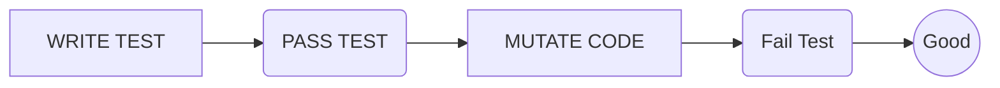
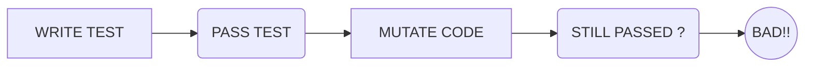

# Mutation Test 

As the name suggests, mutation testing is a software testing type that is based on changes or mutations. Miniscule changes are introduced into the source code to check whether the defined test cases can detect errors in the code.

indonesia :
Mutation testing merupakan testing yang dilakukan berdasarkan perbuhan atau mutasi ( terhadap suatu program dengan memodifikasi satu bagian kecil dari sebuah fungsi/method kode program ). Untuk Mengechek error code atau test case sudah cukup atau belum.

# What The Heck is this ?

Let me simplify:
 1. You Write Test 
 2. You Pass The Test 
 3. You Mutate Your Code 
 4. You Fail The Test
 5. GOOD !
 

#
 1. You Write Test 
 2. You Pass The Test 
 3. You Mutate Your Code 
 4. The Test still passed ?
 5. BAD !

Then Do something until the test possibly to fail

## Mutation Testing Benefits

> Hundred percent Test Coverage isn't enough to check if your code is fully tested !

one of benefits is to find out if our test case is enough or not 

## What Can Mutate ?

X + Y 
can become :
	X - Y
	X * Y
	X / Y
	X ^ Y
________
X || Y
can become :
	X  && Y
_____
X == Y
can become
X !==Y
___

> IF(true) doSomething()
ELSE Return Error

can become:
> IF(true) doSomething()

>https://www.youtube.com/watch?v=GS16Hyad-i0
>https://www.softwaretestinghelp.com/what-is-mutation-testing/